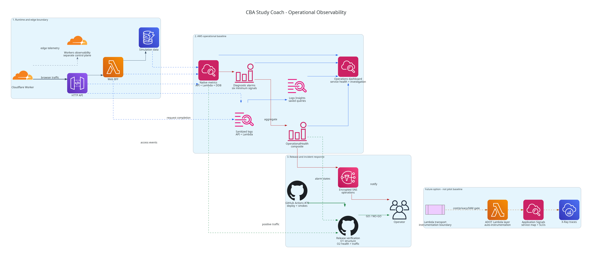

# AWS Operational Observability Baseline (#82)

This document defines the minimum operational observability required before the CBA Study Coach
pilot can be promoted through #70. It is the canonical implementation contract for #82.

Operational telemetry answers whether the platform is healthy. Product analytics (#18) answers
how learners use and improve through the product. These concerns remain separate: CloudWatch
must not become a learner-event warehouse.

## 1. Decision Summary

The pilot uses a native, low-cost AWS baseline:

- native API Gateway, Lambda, and DynamoDB metrics;
- privacy-safe structured JSON application and access logs;
- request correlation at the Web BFF transport boundary;
- one CloudWatch operations dashboard per environment;
- deterministic alarms, SNS notifications, and Logs Insights queries;
- structural and post-smoke release gates in #70.

The pilot does **not** add manual OpenTelemetry code. Application Signals with the AWS Distro for
OpenTelemetry (ADOT) Lambda layer is the preferred Phase 2 evolution because it can auto-instrument
the Lambda without introducing provider dependencies into domain or application code. It requires
a separate cost, privacy, sampling, and IAM decision.

## 2. Architecture View



Regenerate the image with:

```bash
python3 docs/architecture/diagrams/operational_observability.py
```

The diagram has four intentional boundaries:

1. Product traffic remains `Cloudflare -> API Gateway -> Lambda BFF -> DynamoDB`.
2. AWS workloads emit bounded logs and native metrics into the CloudWatch control plane.
3. #70 reads observability state through O1/O2 gates; it does not expose logs to learners.
4. Cloudflare telemetry stays in Cloudflare, while OTEL/Application Signals remains a later option.

## 3. Current State

The `ObservabilityStack` is implemented (#82 Slice B) and synthesises credential-free for `dev`
and `pilot`, but nothing in this baseline is deployed yet: the authorized AWS account still has no
CBA Study Coach dashboard, alarm set, or application log groups, and the SecurityStack remains the
only deployed application stack. Observability is therefore a required dependency of the pilot
deployment, not a follow-up after launch. Every guarantee below is currently a synth-time
guarantee; the live notification-path proof (§14) is what converts it into an operational one.

## 4. Ownership

| Owner | Responsibility |
| --- | --- |
| `ApiStack` | Explicit Lambda log group and retention, structured JSON application logging, API Gateway access log group and allowlisted access-log format |
| `DataStack` | DynamoDB resource and native metrics consumed by alarms; no observability IAM resources |
| `IdentityStack` | Cognito resources; tokens, claims, email, and learner identity must never be logged |
| `ObservabilityStack` | Customer-managed KMS key, encrypted SNS notification topic, CloudWatch alarms, dashboard, saved Logs Insights queries, the environment-scoped read-only observability-gate role, and the optional project-scoped budget |
| `SecurityStack` | The **account-global** GitHub OIDC identity provider only. It is not re-created anywhere else, and it grants nothing on its own |
| BFF transport | Request correlation and sanitized operational events; no CloudWatch or OTEL SDK dependency |
| Domain/application | No AWS, CloudWatch, OTEL, dashboard, alarm, or logging-framework imports |
| Cloudflare platform | Worker/edge logs and analytics; not automatically visible in CloudWatch |

Cross-stack references are explicit. The stack that owns a workload owns its log emission
configuration; the ObservabilityStack composes metrics and notifications without taking ownership
of the workload itself.

### 4.1 Why the gate role is resource-local

The OIDC **provider** and the **role that trusts it** are different kinds of object, and splitting
them the other way was the wrong cut:

- The provider is an account-level identity boundary. One issuer may have exactly one provider per
  account, so it must have exactly one owner — `SecurityStack`. `ObservabilityStack` imports it by
  ARN and never creates one; a second provider for `token.actions.githubusercontent.com` is a
  deploy-time conflict, and the synth tests assert that no provider resource appears here.
- The role grants read access to *these* alarms, *this* dashboard and *this* topic. Its permission
  set is only reviewable next to the resources it reads. Owned by a security stack that cannot see
  those resources, the role's scope would be maintained by hand and would drift the moment a topic
  or alarm is renamed — the failure being silent, because a stale ARN in an Allow denies quietly.

So: provider account-global and centrally owned, role environment-scoped and resource-local, wired
to the topic construct rather than to a written-out ARN.

## 5. Environment Posture

| Control | `dev` | `pilot` |
| --- | --- | --- |
| Application/API log retention | 7 days | 30 days |
| Dashboard | required | required |
| Alarm set | required | required |
| Saved operational queries | required | required |
| Operator notification subscription | optional | required and confirmed before promotion |
| Missing-data posture | `notBreaching` | `notBreaching` |
| Post-smoke traffic evidence | required | required |

No indefinite application-log retention is allowed. Log groups must be explicit CDK resources so
retention and removal behavior are testable before deployment.

Today the Lambda's log group is created implicitly by the runtime with never-expiring retention.
Making it an explicit resource therefore needs an adoption plan decided **before the first deploy**,
not discovered during one: either the environment is still undeployed (the explicit group is simply
created), or the existing `/aws/lambda/<function>` group must be imported/adopted so CloudFormation
does not fail on an already-existing resource. The chosen path, and the removal policy for each
environment, are recorded with the implementation.

## 6. Code Instrumentation Boundary

The pilot needs a small amount of transport instrumentation, not manual OTEL spans.

| Layer | Pilot behavior |
| --- | --- |
| API Gateway | Native access logs and metrics; no request/response bodies |
| Lambda/BFF transport | One sanitized completion event per request, including duration and result |
| Application use cases | Return domain-safe results/errors; no logging or telemetry SDK |
| Domain | No observability dependency |
| Repository adapters | Rely on native DynamoDB metrics; log only sanitized operational failures through the transport/composition boundary |

Every BFF request completion event uses this allowlist:

- `level`, `message`, `requestId`, `routeKey`, and `method`;
- `statusCode`, `durationMs`, `errorCode`, and `runtimeEnv`.

The event is emitted once after the response shape is known. Error objects are mapped to stable
domain-safe `errorCode` values before logging.

Request correlation has one canonical identity:

1. API Gateway access logs emit `$context.requestId` under the field `requestId`.
2. The Lambda transport reads `event.requestContext.requestId` and passes it into the neutral BFF
   request as `requestId`.
3. The dispatcher reuses that value in both the sanitized completion event and every error
   envelope. It does not create an independent deployed-runtime id.
4. Local/in-process transports generate an opaque id before dispatch; contract tests inject a
   deterministic id.

`context.awsRequestId` identifies a Lambda invocation and may appear in AWS-managed Lambda platform
logs under its own field. The application never copies it into the canonical `requestId` or the
completion event, and correlation query 5 never joins on it.

## 7. Logging and Privacy Contract

Application logs are single-line structured JSON. API Gateway access logs may contain only request
id, route key, status, response latency, and integration status.

The following are forbidden in application and access logs:

- `Authorization` headers, JWTs, refresh tokens, cookies, or OAuth codes;
- Cognito claims, email, learner ids, attempt/session/question ids, or source URLs;
- request/response bodies, question stems, options, answers, explanations, or coach text;
- table names, account ids, ARNs, secret values, or environment URLs;
- source IP and user-agent by default.

Exception objects and stack traces may be emitted only after sanitization; they must not include
request data or credentials. Logging tests must use positive controls that prove a forbidden field
would fail the guard.

## 8. Dashboard Design

Create one dashboard per environment, with an eight-hour default window and inherited widget
periods. Use a stable 24-column layout:

| Row | Panels |
| --- | --- |
| 1 - Service health | Alarm status for the complete minimum set and the aggregate operational-health alarm |
| 2 - HTTP API | Request count, `4xx`, `5xx`, p50/p95/p99 latency, integration latency |
| 3 - Lambda BFF | Invocations, errors, throttles, p95 duration, concurrent executions |
| 4 - DynamoDB | Consumed capacity, successful-request latency, throttling, system errors |
| 5 - Investigation | Recent sanitized 5xx events, errors grouped by `errorCode`/`routeKey`, slow routes |

HTTP APIs expose no native "integration errors" metric — integration failures surface as `5xx` on
the route, and `IntegrationLatency` is the supported signal for the integration itself, so row 2
uses those rather than a metric that does not exist.

Generic API `4xx` remains dashboard telemetry, not a release-blocking alarm: authentication and
learner input errors would create noisy incidents. The dashboard contains no learner/product
analytics, physical identifiers, environment URLs, or secret values.

## 9. Minimum Alarm and Notification Set

Use native AWS metrics with a five-minute evaluation window. Every alarm explicitly treats missing
data as `notBreaching` to avoid false incidents before traffic begins.

| Alarm | Metric | Initial threshold | Release effect |
| --- | --- | --- | --- |
| API server errors | API Gateway `5xx` count | sum >= 1 | block |
| Lambda errors | Lambda `Errors` | sum >= 1 | block |
| Lambda throttling | Lambda `Throttles` | sum >= 1 | block |
| Lambda high duration | Lambda `Duration` | p95 >= 12 seconds | block |
| DynamoDB system errors | DynamoDB `SystemErrors` | sum >= 1 | block |
| DynamoDB throttling | DynamoDB throttled requests/events | sum >= 1 | block |

The Lambda timeout is 15 seconds, so the duration alarm warns before the hard timeout. Thresholds
are pilot defaults and must be tuned from observed traffic without silently weakening a release
gate.

Create an aggregate `OperationalHealth` composite alarm over the minimum set. Individual alarms
remain the diagnostic source and have no SNS alarm action; the composite is the sole SNS alarm
action and top dashboard status, reducing duplicate operator notifications when one incident trips
multiple symptoms.

Because notification depends entirely on the composite, its wiring is a tested invariant: the
composite rule must reference **exactly the six alarms above** — no fewer, no extras — and it must
be the **only** resource in the environment carrying an SNS alarm action. An offline assertion
checks both directions, so a dropped alarm or a second publisher fails synth instead of silently
muting or duplicating operator notification.

Create one SNS operational-alert topic per environment. The topic uses server-side encryption with
a customer-managed KMS key owned by the ObservabilityStack; the AWS-managed `alias/aws/sns` key is
not sufficient because its policy cannot be extended for CloudWatch alarm use. Enable key rotation.

The SNS resource policy allows only the `cloudwatch.amazonaws.com` service principal to call
`sns:Publish`, restricted to the same account and the environment's alarm ARN prefix through
`aws:SourceAccount` and `aws:SourceArn`. The KMS key policy grants that same principal only
`kms:Decrypt` and `kms:GenerateDataKey*`, restricted by `aws:SourceAccount`. Do not require an alarm
`aws:SourceArn` condition in the key policy unless a synth/live integration test proves CloudWatch
propagates that context to KMS. Offline tests must prove that neither policy grants a wildcard action
or an unrelated publisher.

Reference: [AWS guidance for CloudWatch alarms with encrypted SNS topics](https://repost.aws/knowledge-center/cloudwatch-configure-alarm-sns).

Subscription endpoints are operator configuration and must never be committed. The pilot release
requires at least one confirmed subscription. No automatic remediation is part of the pilot.

## 10. Saved Logs Insights Queries

Version these operational queries with the ObservabilityStack:

1. recent server failures: sanitized events with `statusCode >= 500`;
2. errors by `errorCode`, `routeKey`, and five-minute window;
3. p50/p95/p99 `durationMs` by `routeKey`;
4. Lambda timeout/cold-start indicators from platform report events;
5. API-to-Lambda correlation by the canonical API Gateway `requestId`, which is copied unchanged
   into the BFF completion event and error envelope.

Queries must select only allowlisted fields. They are investigation tools, not durable product
analytics or scheduled learner-data exports.

**Two different bounds, enforced in two different places.** A saved query carries `| limit N`, which
caps the rows returned — it does not cap what the query scans. Logs Insights has no time clause in
its query language; the window is `startTime`/`endTime` on the `StartQuery` call. A saved query text
therefore cannot be time-bounded, and treating `limit` as a time bound would be a false assurance
about both cost and exposure. **Every execution must pass an explicit bounded window**, and that
enforcement belongs to the caller: #70 for the release gates, the operator otherwise. The
ObservabilityStack ships the query definitions only — it has no query runner, and the gate role
deliberately holds no `logs:StartQuery`.

## 11. Cross-Cloud Boundary

CloudWatch cannot observe failures that happen inside the Cloudflare Worker, at the edge, or before
the request reaches AWS. The pilot therefore keeps two operational views:

- Cloudflare Workers logs/analytics for edge execution, deployment health, and frontend failures;
- CloudWatch for API Gateway, Lambda, DynamoDB, alarms, and AWS release health.

Do not stream all Cloudflare logs into CloudWatch for the pilot. #70 combines both control planes
through deterministic frontend and backend smokes. Future end-to-end tracing may propagate the W3C
`traceparent` header, but only after privacy, sampling, and CORS/header behavior are designed.

## 12. OTEL and Application Signals Evolution

Phase 2 may enable CloudWatch Application Signals through the enhanced ADOT Lambda layer. AWS
documents this as automatic Lambda instrumentation that can collect requests, availability,
latency, errors, faults, dependencies, metrics, and traces without manual application changes.

The follow-up must define:

- sampling, trace retention, and expected CloudWatch/X-Ray cost;
- a low-cardinality resource model such as `service.name`, `service.version`, and
  `deployment.environment`;
- explicit denial of learner, attempt, question, source, token, and content attributes;
- the exact Lambda layer/runtime compatibility and startup configuration;
- least-privilege IAM, including a documented exception process for AWS telemetry actions that do
  not support resource-level scoping;
- removal/avoidance of competing X-Ray SDK instrumentation;
- whether SLOs use Application Signals after enough pilot traffic exists.

Manual `@opentelemetry/*` dependencies are not allowed in domain/application. If a critical
operation cannot be auto-instrumented, a later manual span belongs in the Lambda transport or an
infrastructure telemetry adapter.

Official references:

- [Enable Application Signals on Lambda](https://docs.aws.amazon.com/AmazonCloudWatch/latest/monitoring/CloudWatch-Application-Signals-Enable-LambdaMain.html)
- [Application Signals and Lambda](https://docs.aws.amazon.com/lambda/latest/dg/monitoring-application-signals.html)
- [Migrate Node.js tracing to OpenTelemetry](https://docs.aws.amazon.com/xray/latest/devguide/migrate-xray-to-opentelemetry-nodejs.html)

## 13. Synthetic Monitoring

After the first integrated deployment, a separate opt-in task may add CloudWatch Synthetics:

- heartbeat the public logical-only `/api/readiness` endpoint;
- monitor the Cloudflare frontend health route;
- alarm on availability and latency without using a learner account;
- disable screenshots and body capture where exam content could appear.

Authenticated synthetic journeys require a dedicated synthetic identity lifecycle and are not part
of #82. Until then, #70 deployed smokes are the end-to-end validation source.

Reference: [CloudWatch Synthetics canaries](https://docs.aws.amazon.com/AmazonCloudWatch/latest/monitoring/CloudWatch_Synthetics_Canaries.html).

## 14. Cost Guardrail

A project budget may be created only after the `Project` cost-allocation tag is activated and its
filter is proven to isolate CBA Study Coach resources. The monthly amount is deployment
configuration, not a repository default.

The budget is intentionally omitted from the operational flow diagram: it is a conditional
governance control, not part of the request, alarm, notification, or release-health path.

Do not create a misleading account-wide budget under the application name. Bedrock usage and
`AIUsageEvent`/`AgentRunRepository` remain the source for model-level cost attribution. Application
Signals, X-Ray, Synthetics, anomaly detection, and log-class changes require explicit cost review.

## 15. Release Gates

Issue #70 must implement two deterministic, no-AI-spend gates.

### O1: Structural Observability Gate

Run after the AWS stacks deploy and before learner smokes:

- explicit Lambda and API access log groups exist with correct retention;
- structured logging and the access-log allowlist are configured;
- dashboard, saved queries, SNS topic, aggregate alarm, and the complete alarm set exist;
- every alarm has `TreatMissingData=notBreaching`;
- pilot has a confirmed notification subscription.

Any failure blocks smokes and promotion.

### Read-only IAM surface for O1/O2

The #70 observability-gate job assumes a dedicated environment-scoped GitHub OIDC role. The role is
created by `ObservabilityStack` (see §4.1) and trusts the account-global provider owned by
`SecurityStack`, on an exact subject: this repository, GitHub Environment `dev` or `pilot`, and
`aud=sts.amazonaws.com` — an `environment:` subject rather than a `ref:` one, so it is reachable
only from a job GitHub has already gated. It has no deploy permissions and receives only these read
actions:

- O1: `logs:DescribeLogGroups`, `logs:DescribeQueryDefinitions`,
  `cloudwatch:GetDashboard`, `cloudwatch:DescribeAlarms`, `sns:GetTopicAttributes`, and
  `sns:ListSubscriptionsByTopic`;
- O2: `cloudwatch:DescribeAlarms` and `cloudwatch:GetMetricData`.

No write, query-execution, subscription, alarm-state mutation, or log-content read is allowed. The
role ARN is never emitted as a stack output; #70 resolves the role by its logical name.
There is never an `Action: "*"`. CloudWatch and Logs list/describe/get operations that do not
support resource-level authorization may use `Resource: "*"` only in an isolated read-only
statement containing the exact actions above — that statement must contain nothing else, so an
offline test fails if any additional action is ever added to it. SNS reads are scoped to the
environment topic. Offline IAM tests must reject any broader action set.

### Notification-path proof (mandatory promotion prerequisite, executed outside O1/O2)

O1 proves the topic, key, policies and alarms EXIST; O2 proves telemetry flows and alarms are `OK`.
Neither proves that CloudWatch can actually publish through the customer-managed key to a
subscriber — the one failure mode that is silent, because a broken key policy loses notifications
without changing any alarm state.

That end-to-end proof (CloudWatch -> SNS -> KMS -> confirmed subscription) is a **required
prerequisite for promotion**, recorded per environment:

- it must be satisfied **before the first promotion to `pilot`**;
- it must be **re-proven after any change to the KMS key policy or the SNS topic policy, before the
  next promotion**;
- promotion is **not allowed** while the current evidence is missing, stale relative to the last
  key/topic policy change, or negative.

Its execution is deliberately separate from the automated gates:

- it runs **outside O1 and O2**, as an explicitly human-gated live verification under **operator
  credentials**;
- it grants the read-only OIDC gate role **no additional permission** — publishing and alarm-state
  actions belong to the operator session, never to the gate role;
- its evidence is recorded as a logical statement (which environment, which date, confirmed
  yes/no, and the policy version it attests to), never as endpoints, ARNs, account ids, or message
  payloads.

So the automated release gates never *perform* this proof, but a promotion that lacks valid
evidence for it is blocked.

### O2: Post-Smoke Health Gate

After deployed learner smokes:

- capture the smoke-window start immediately before the first BFF smoke;
- poll for at most 10 minutes until native metrics report both API Gateway `Count` sum >= 1 and
  Lambda `Invocations` sum >= 1 in the bounded smoke window;
- only after positive traffic evidence exists, evaluate alarm state;
- every required alarm and the aggregate alarm must be `OK`;
- `ALARM` blocks immediately;
- absent traffic evidence, `INSUFFICIENT_DATA`, or any other non-`OK` state at the end of the
  window blocks promotion.

`TreatMissingData=notBreaching` remains the alarm posture, but it cannot by itself satisfy O2.
The explicit traffic check prevents a green release when smokes never reached the deployed API or
Lambda.

O2 proves **telemetry ingestion**, not functional coverage: `Count >= 1` and `Invocations >= 1`
show that requests reached the deployed API and Lambda and that their metrics are flowing. They do
not show that every contract route was exercised. Functional coverage remains the job of the #70
deployed learner smokes; O2 must never be read as evidence that the learner loop is correct.

The release summary records only logical alarm names/states and whether the minimum traffic
evidence was observed. It must not print endpoints, metric dimensions, resource ids, ARNs, account
ids, counts tied to learners, or log payloads.

## 16. Explicit Non-goals

The pilot baseline does not enable X-Ray, Application Signals, manual OTEL spans, custom
high-cardinality metrics, request/response body capture, Cognito advanced-security logging,
Bedrock invocation logging, learner analytics, automatic remediation, or paid AI validation.

## 17. Delivery and Validation

Issue #82 must:

1. replace the placeholder ObservabilityStack;
2. add the workload-owned log resources/configuration;
3. add offline CDK assertions for retention, alarms, composite alarm, missing-data treatment,
   dashboard, queries, encrypted topic/key policies, exact read-only gate actions, no wildcard
   actions, and only the documented resource-wildcard exceptions;
4. assert the composite references exactly the six alarms and is the only resource with an SNS
   alarm action;
5. add tests proving ONE `requestId` per request: the value the transport put on the neutral
   request appears unchanged in both the sanitized completion event and the error envelope, with a
   negative control for a second generated id;
6. record the Lambda log-group adoption decision before any deploy;
7. update #55, #56, and #70 implementation evidence;
8. remain synth/test-only until a separate human deployment gate.

The implementation must not deploy resources, subscribe an operator, enable OTEL/Application
Signals, create a canary, or invoke a model without a separate explicit human gate.
