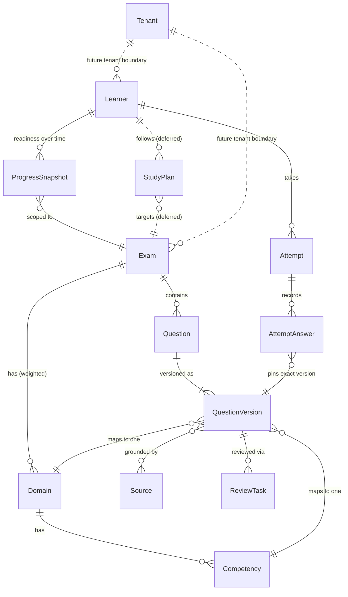

# SaaS Data Model — CBA Pilot → Generic Exam Platform (#16)

Canonical data model for the source-grounded exam SaaS. It names the entities the frontend (#35), the
Web BFF contracts (#36), and future persistence share, grounded in the bounded contexts of
[`spec/domain-driven-design.md`](../../spec/domain-driven-design.md) and the constraints of
[`spec/product-roadmap.md`](../../spec/product-roadmap.md).

- **Issue:** #16 (Phase 1 — CBA Web MVP; the same model carries Phase 5 multi-cert).
- **Status:** design-time documentation. No database, schema migration, or persistence code exists here.
- **Consumers:** [`web-bff-contracts.md`](web-bff-contracts.md) (#36),
  [`frontend-screen-map.md`](frontend-screen-map.md) (#35),
  [`ADR-0002`](../adr/0002-cloudflare-nextjs-aws-bff.md) runtime split.

## Modeling principles

1. **Source-grounded only.** A question without an official source is not publishable. Sources are
   first-class data, not markdown decoration.
2. **AI drafts, humans publish.** AI-generated content enters as a draft `QuestionVersion`; the human
   review gate is the only path to learner-visible content.
3. **Attempts pin exact versions.** An `Attempt` references the immutable `QuestionVersion` shown —
   never a mutable draft — so history survives content revisions.
4. **Deterministic first.** Scores, readiness, and progress are computed deterministically from
   attempts. The coach explains and recommends; it never writes mastery state.
5. **CBA is configuration, not code.** Every entity binds `exam → domain → competency → question`;
   a new certification is data (Phase 5), not new entities.
6. **No provider internals in the public model.** Model IDs, tiers, agent runs, token usage, and
   orchestration metadata live in internal operational entities (see "Adjacent internal entities")
   and never appear in learner/admin-facing payloads.
7. **Naming:** the exam blueprint area is called **Domain** in product/docs and `ExamDomain` in code,
   reserving bare "domain" for DDD language (see the DDD spec's naming note).

## Entity overview



Dashed lines are deferred/future relations: `StudyPlan` arrives with the study-plan phase, and
`Tenant` is the future multi-tenant boundary (the pilot stays single-tenant).

---

## Entities

### 1. Exam

- **Purpose:** the certification being practiced — the root configuration every surface binds to.
- **Key fields:** `examId` (slug, pilot `"cba"`), `name`, `blueprintVersion`, `questionCount` (60),
  `timeLimitSeconds` (5400), `targetPercent` (75, flagged `official: false`), `status`
  (`active | draft | retired`).
- **Relations:** 1—N `Domain`; 1—N `Question`; scoped by `Attempt` and `ProgressSnapshot`.
- **Pilot vs generic:** pilot ships exactly one seeded exam (`cba`); generic makes exams tenant-managed
  data — same fields, many rows. The blueprint numbers are echoed by the BFF (never hardcoded in the
  frontend).
- **DDD ownership:** Exam Content context.

### 2. Domain (`ExamDomain` in code)

- **Purpose:** a weighted blueprint area of an exam; drives mock-exam assembly, dashboard bars, and
  authoring coverage.
- **Key fields:** `domainId`, `examId`, `name`, `slug`, `weightPercent`, `order`, `sourceRules[]`
  (`{ baseUrl }` allowlist that scopes this domain's official sources and the crawler).
- **Relations:** N—1 `Exam`; 1—N `Competency`; referenced by `QuestionVersion` (exactly one) and by
  per-domain rollups in `Attempt`/`ProgressSnapshot`.
- **Invariant:** an exam's domain weights sum to ≤ 100 (`409 DOMAIN_WEIGHTS_EXCEEDED` in #36).
- **Pilot vs generic:** pilot seeds the four CBA domains — Development Workflow 24, Infrastructure 22,
  Catalog 22, Customizing 32; generic manages domains via `POST /api/admin/domains` (#36) as the seam
  where a new exam takes shape.
- **DDD ownership:** Exam Content context.

### 3. Competency

- **Purpose:** the skill inside a domain that questions test and progress tracks; the unit the coach
  recommends drills against.
- **Key fields:** `competencyId`, `domainId` (exactly one parent), `name`, `slug`, `description?`.
- **Relations:** N—1 `Domain`; referenced by `QuestionVersion` (exactly one), `ProgressSnapshot`
  per-competency rollups, and coach recommendations.
- **Pilot vs generic:** pilot uses the CBA blueprint competencies; generic adds/edits them with the
  domain via the admin surface. Same shape.
- **DDD ownership:** Exam Content context.

### 4. Source

- **Purpose:** an official documentation reference — the trust anchor. Grounds question versions,
  explanations, and coach replies (`Source: backstage.io/docs/...` chips in #35).
- **Key fields:** `sourceId`, `url` (canonical), `title`, `status` (`active | dead | blocked`),
  `lastCheckedAt`, `fingerprint?` (content hash for drift detection), optional `domainId` scoping.
- **Relations:** N—M `QuestionVersion` (via `sourceRefs`); registered/scoped by `Domain.sourceRules`;
  health history lives in internal `SourceCheck`/`SourceDrift` records.
- **Invariants:** a dead source blocks publication of the versions citing it; detected drift can
  reopen review for affected `QuestionVersion`s.
- **Pilot vs generic:** pilot registry is `backstage.io/docs/...`; generic keeps one registry per
  exam fed by each domain's `sourceRules`.
- **DDD ownership:** Exam Content (registry) with health owned by the Source Provenance context.

### 5. Question

- **Purpose:** the stable identity of an item across revisions, so attempt history, analytics, and
  review threads survive content edits.
- **Key fields:** `questionId`, `examId`, `domainId`, `competencyId`, `origin` (`ai_draft | manual`),
  `currentPublishedVersionId?`, `latestVersion` (int), `createdAt`.
- **Relations:** N—1 `Exam`; 1—N `QuestionVersion` (at most one `published` at a time).
- **Pilot vs generic:** identical; only the volume and the `examId` spread change.
- **DDD ownership:** Exam Content context.

### 6. QuestionVersion

- **Purpose:** the immutable, reviewable snapshot of a question — the only thing learners ever see,
  and the only thing attempts reference.
- **Key fields:** `questionVersionId`, `questionId`, `version` (int), `status`
  (`draft | in_review | approved | published | rejected | deprecated`), `stem`, `options[]`
  (`{ key: "A".."D", text }`), `correctOption` (server-side only pre-submission), `explanation`,
  `whyOthersWrong?`, `difficulty`, `domainId`, `competencyId`, `sourceRefs[]`
  (`{ sourceId, title, url }`, ≥ 1 to publish), `provenance` (`{ origin, draftedAt, reviewedBy?,
  approvedAt? }`), `legacyExternalId?` (id in the Phase 0 JSON bank, set by migration), `tags?[]`
  (authoring/search metadata, not learner-facing).
- **Relations:** N—1 `Question`; exactly one `Domain` and one `Competency`; N—M `Source`; pinned by
  `AttemptAnswer`.
- **Invariants:** immutable once `published` — edits create a new version; `published` requires
  passing the human review gate; source drift may flag a published version back to review or
  `deprecated`. Provenance records the human reviewer; internal generation details (model, run) stay
  in the AI-orchestration audit, never here.
- **Pilot vs generic:** identical. The pilot bank (60 approved CBA items) maps 1:1 onto this shape.
- **DDD ownership:** Exam Content (state) with lifecycle transitions owned by Authoring & Review.

### 7. Attempt

- **Purpose:** one learner session against an exam — full mock or focused drill — and the
  deterministic record everything downstream derives from.
- **Key fields:** `attemptId`, `learnerId`, `examId`, `kind` (`mock | practice`), `status`
  (`in_progress | submitted | expired | abandoned`), `config` snapshot (`{ questionCount,
  timeLimitSeconds, domainId?, competencyId?, onlyMissed? }`), `questionOrder[]`
  (`{ index, questionVersionId }` fixed at start), `startedAt`, `expiresAt`, `submittedAt?`,
  `score` (`{ correct, total, percent }`, computed at submit), `perDomain[]` rollup.
- **Relations:** N—1 `Learner`; N—1 `Exam`; 1—N `AttemptAnswer`; folded into `ProgressSnapshot`.
- **Invariants:** references exact `QuestionVersion`s; scoring is deterministic and reproducible from
  answers; at most one in-progress mock per learner (`409 MOCK_EXAM_IN_PROGRESS` in #36); mock mode
  reveals no correctness until submission.
- **Pilot vs generic:** identical; drill `config` fields already generalize (domain/competency refs).
- **DDD ownership:** Simulation context (`MockExam`/`DomainDrill` are `kind`+`config` readings of the
  same record).

### 8. AttemptAnswer

- **Purpose:** one answered (or skipped/flagged) item inside an attempt — the atomic evidence for
  scoring, missed-review, and mastery.
- **Key fields:** `attemptId` + `index` (natural key), `questionVersionId`, `selectedOption?`,
  `isCorrect?` (set at submit for mocks, immediately for practice), `flagged`, `answeredAt?`,
  `timeSpentSeconds?`.
- **Relations:** N—1 `Attempt`; N—1 `QuestionVersion` (pinned).
- **Invariants:** preserves the question version, the selection, correctness, and timing (DDD spec
  rule); never mutated after attempt submission.
- **Pilot vs generic:** identical.
- **DDD ownership:** Simulation context.

### 9. Learner

- **Purpose:** the studying user — owner of attempts, progress, streak, and preferences.
- **Key fields:** `learnerId` (opaque; maps to the identity provider's subject — Cognito in
  ADR-0002, kept as an infrastructure detail), `displayName`, `email?`, `activeExamId`,
  `preferences` (`{ reminders, appearance, accessibility }`), `streak` (`{ current, lastStudyDate }`),
  `createdAt`.
- **Relations:** 1—N `Attempt`; 1—N `ProgressSnapshot`.
- **Invariants:** identity is implicit from the session at the BFF (#36) — learners are never
  enumerable through public endpoints; roles (`learner | admin`) gate the admin surface.
- **Pilot vs generic:** pilot is single-tenant (individual learners, no organization layer); generic
  adds `Tenant/Organization` scoping — every tenant-owned entity gains a `tenantId`, learners join
  organizations, and entitlements arrive with billing (deferred phases).
- **DDD ownership:** Learner Progress context (study state); account identity/auth is an
  interfaces/infrastructure concern, not domain.

### 10. ProgressSnapshot

- **Purpose:** the deterministic, point-in-time readiness rollup that powers the dashboard, the
  progress screen, trend lines, and coach recommendations — fast to read, cheap to recompute.
- **Key fields:** `snapshotId`, `learnerId`, `examId`, `asOf`, `overall`
  (`{ readinessPercent, targetPercent }`), `perDomain[]` (`{ domainId, readinessPercent, answered,
  correct }`), `perCompetency[]` (same shape), `weakestCompetencyId`, `recommendedDrill`
  (`{ domainId?, competencyId?, questionCount, reason }`).
- **Relations:** N—1 `Learner`; N—1 `Exam`; derived from `Attempt`/`AttemptAnswer` history; read by
  `GET /api/dashboard`, `GET /api/progress` (deferred), and the coach.
- **Invariants:** a **materialized view, not a source of truth** — always recomputable from attempts;
  written only by deterministic progress use cases (AI never writes it); snapshots over time form the
  trend. It materializes the DDD spec's `LearnerCompetencyState` per competency; a finer-grained
  mutable state entity can be added later without changing consumers.
- **Pilot vs generic:** identical; readiness weighting follows the exam's domain weights, so a new
  exam changes data, not the formula's shape.
- **DDD ownership:** Learner Progress context.

### 11. ReviewTask

- **Purpose:** one unit of human review work over a draft `QuestionVersion` — the human gate as data.
  It backs the #36 admin review queue (`GET /api/admin/questions/review`).
- **Key fields:** `reviewTaskId`, `questionVersionId`, `examId`, `status`
  (`open | in_review | completed`), `assignee?` (admin), `decision?` — the embedded review decision
  (`{ type: approve | reject | request_changes, reasonCode?, note?, decidedBy, decidedAt }`),
  `openedAt`.
- **Relations:** N—1 `QuestionVersion` (every new draft version opens a task); the decision drives the
  version's status transition (`approve → published`, `reject → rejected`,
  `request_changes → new draft version`); `SourceDrift` can open a new task for a published version.
- **Pilot vs generic:** pilot — the migrated 60-item bank enters as already approved (no retroactive
  tasks); tasks begin with the first AI drafts (Phase 4 authoring pipeline, read surface already
  contracted by #36). Generic — assignment, SLAs, and per-exam queues on the same shape.
- **DDD ownership:** Authoring & Review context.

### 12. StudyPlan *(deferred — Phase 2/3)*

- **Purpose:** a deterministic, editable sequence of study actions (drills, mocks, review blocks) that
  turns readiness gaps into a plan the learner can follow.
- **Key fields:** `studyPlanId`, `learnerId`, `examId`, `targetDate?`, `generatedFromSnapshotId`,
  `items[]` (`{ order, type: drill | mock | review, domainId?, competencyId?, questionCount?,
  status: pending | done | skipped }`), `updatedAt`.
- **Relations:** N—1 `Learner`; N—1 `Exam`; generated from a `ProgressSnapshot`; items reference
  `Domain`/`Competency`; the coach may explain the plan, but generation stays deterministic-first
  (roadmap rule 5).
- **Pilot vs generic:** deferred past the pilot — the dashboard's `recommendedDrill` is its embryo;
  the study-plan phase adds reminders and personalization on this shape.
- **DDD ownership:** Learner Progress context.

### 13. Tenant / Organization *(deferred — future multi-tenant boundary)*

- **Purpose:** the future tenancy boundary — groups learners, owns or subscribes to exams, and anchors
  billing entitlements when those phases arrive.
- **Key fields:** `tenantId`, `name`, `slug`, `status`, `createdAt` (+ entitlement references when
  billing lands).
- **Relations:** 1—N `Learner` (membership + roles); 1—N `Exam` (tenant-managed or
  catalog-subscribed); becomes the scoping key (`tenantId`) on tenant-owned entities.
- **Pilot vs generic:** the pilot is deliberately **single-tenant** — no `tenantId` fields anywhere
  yet. Documenting the boundary now makes tenancy an additive migration (add the scoping key), not a
  redesign. Phases 5/6 activate it together with roles and billing.
- **DDD ownership:** a scoping boundary that spans contexts — owned by the future identity/billing
  supporting contexts; study semantics stay with their home contexts.

---

## Content provenance (Source → QuestionVersion → Review → Published)

```txt
Source (official doc, health-checked)
  └─ grounds ─▶ QuestionVersion (draft; origin: ai_draft | manual; sourceRefs required)
        └─ ReviewTask ─▶ human ReviewDecision: approve / reject / request-changes   ← the human gate
              ├─ approve ─▶ status: published (immutable; the only learner-visible state;
              │             Question.currentPublishedVersionId updated)
              ├─ reject ──▶ status: rejected (kept for audit; never learner-visible)
              └─ changes ─▶ new draft version (version + 1)
Source drift/death (SourceCheck) ─▶ flags affected published versions ─▶ reopen review or deprecate
```

Rules this chain enforces (roadmap non-negotiables): no source ⇒ not publishable; AI output is draft
until human review; published versions are immutable and version-pinned by attempts; drift reopens
review instead of silently mutating content.

## Attempt & progress pipeline (Attempt → Score → ProgressSnapshot)

```txt
StartMockExam / StartDrill (use case)
  └─ Attempt created: config snapshot + questionOrder pinned to published QuestionVersions
        └─ AttemptAnswer per item: selection, correctness, timing (no feedback in mock mode)
              └─ submit ─▶ deterministic Score: overall + per-domain (+ per-competency)
                    └─ fold into ProgressSnapshot: readiness vs target, weakest competency,
                       recommended drill, trend point
                          └─ read by dashboard/progress/results — and by the coach, which explains
                             and recommends from it but never writes it
```

## Mapping to the #36 BFF contracts

| Endpoint (#36) | Reads | Writes |
| --- | --- | --- |
| `GET /api/dashboard` | `Exam`, `Domain`, `ProgressSnapshot` (readiness, weakest, drill), recent `Attempt`s, `Learner` (streak) | — |
| `POST /api/mock-exams` | `Exam` blueprint, `Domain` weights, published `QuestionVersion`s | `Attempt` (+ pinned `questionOrder`) |
| `GET /api/attempts/:id/results` | `Attempt`, `AttemptAnswer`, `Domain`, `Source` (via version refs for the coach summary) | — (score computed at submit) |
| `POST /api/coach/message` | `Attempt`/`AttemptAnswer` context, `QuestionVersion` (explanation), `Source`, `ProgressSnapshot` | — public; internal AI audit only (below) |
| `GET /api/admin/questions/review` | `Question`, draft `QuestionVersion`s, `Source`, `Domain`, `Competency` | — |
| `POST /api/admin/domains` | `Exam` | `Domain` (+ `Competency` list, `sourceRules` feeding the `Source` registry) |

Deferred endpoints (practice sessions, answers/submit, missed review, progress, preferences, review
actions) read/write the same entities — `AttemptAnswer` writes arrive with the session flow, review
actions complete `ReviewTask`s and drive `QuestionVersion` status transitions.

## JSON bank migration mapping (Phase 0 → this model)

The Phase 0 engine keeps the CBA bank in `questions/*.json` (validated by `questions/schema.json`).
Migration into the SaaS model is **one-way and mechanical** — each JSON item becomes one `Question`
plus one `QuestionVersion` (`version: 1`, `status: published`, `origin: manual`, provenance noting the
bank migration):

| JSON bank field (`questions/*.json`) | Model target |
| --- | --- |
| `id` (e.g. `cat-001`) | `Question.questionId` seed and `QuestionVersion.legacyExternalId` (traceability) |
| `domain` (name) | resolve to the seeded `Domain` (`domainId`) |
| `competency` (name) | resolve/create `Competency` under that domain (`competencyId`) |
| `question` | `QuestionVersion.stem` |
| `options` (`{A..D}`) | `QuestionVersion.options[]` (`{ key, text }`) |
| `answer` (key) | `QuestionVersion.correctOption` (server-side only pre-submission) |
| `explanation` | `QuestionVersion.explanation` |
| — (not in the Phase 0 bank) | `QuestionVersion.whyOthersWrong?` stays empty; optional in the model |
| `difficulty` | `QuestionVersion.difficulty` |
| `source` (single URL) | upsert a `Source` registry row; becomes the one-element `QuestionVersion.sourceRefs[]` |
| `tags[]` (optional) | `QuestionVersion.tags?[]` (authoring/search metadata, not learner-facing) |

Migration rules:

- **Future attempts pin `QuestionVersion`, never the mutable JSON.** After cutover the SaaS reads only
  published `QuestionVersion`s; the JSON bank remains the Phase 0 CLI engine's source in the repo — no
  dual-write between the two.
- The migrated 60 items enter as already human-reviewed (`published`, no retroactive `ReviewTask`s);
  post-migration edits follow the normal chain (new draft version → review → publish).
- Domain/competency names resolve against the seeded CBA blueprint; unknown names fail the migration
  loudly instead of creating orphans.

## Adjacent internal entities (not part of the public model)

These support the model but never surface in learner/admin payloads; they live in their own bounded
contexts (see the DDD spec):

- **`ReviewDecision`** (Authoring & Review) — modeled here embedded in `ReviewTask.decision`; a
  standalone decision/audit trail entity can be split out later without changing the gate semantics.
- **`SourceCheck`, `SourceDrift`** (Source Provenance) — health/drift history behind `Source.status`.
- **`AgentRun`, `ToolCall`, `AIUsageEvent`** (AI Agent Orchestration) — operational audit of AI work,
  including which model/tier served a request and what it cost. `AIUsageEvent` separates coach usage
  from authoring usage. **None of this appears in the public model or BFF responses** — provenance in
  `QuestionVersion` records *that* something was AI-drafted and *who approved it*, not which provider
  or model produced it.
- **`Subscription/Entitlement`** (Billing) — deferred with monetization; billing never decides content
  correctness or mastery (DDD spec rule). They will attach to `Tenant/Organization` (§13) when both
  phases arrive.

## Persistence posture (deliberately undecided)

No physical database is chosen in #16. The decision is deferred to implementation, informed by the
access patterns below; repositories stay behind application ports (DDD dependency rule), so the
choice is swappable and non-load-bearing for this model:

- **DynamoDB** — fits the AWS control plane (ADR-0002), serverless cost posture, and the key-based
  read patterns (dashboard by `learnerId+examId`, attempt by id, answers by `attemptId`, published
  versions by `domainId/competencyId`).
- **Postgres** — fits the relational integrity of authoring/review (versions, review threads,
  source joins) and ad-hoc analytics.
- A split (operational store + relational authoring store) is also plausible; decide with #33
  implementation, not here.

Primary access patterns to design for: dashboard read (`learnerId+examId` → snapshot + recent
attempts); mock assembly (published versions by domain honoring weights); session writes (answers by
`attemptId+index`); missed review (incorrect answers by attempt with version + sources); review queue
(draft versions by `status+examId+domainId`); readiness recompute (attempt history by learner).

## Out of scope (#16)

- Implementation of any database, schema, migration, repository, or API.
- Question bank content changes (the 60 CBA items map onto `QuestionVersion` via the migration table
  above).
- Billing modeling beyond the notes above; *activation* of the deferred `StudyPlan` and
  `Tenant/Organization` entities (they are specified here, built in later phases).
- OpenAPI/JSON-Schema generation — a follow-up once #33 implementation starts.
